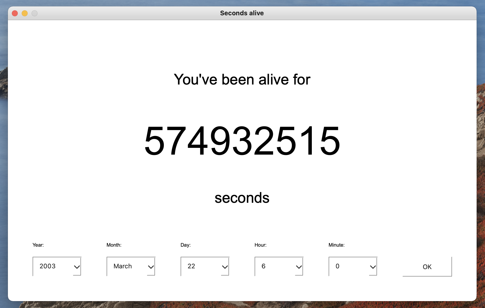

# Seconds-Alive
A simple Python GUI that dynamically displays the amount of seconds you've been alive. Developed by me around 2017 while learning to build graphic interfaces with PyQt.

## Interface and Plot

The interface is developed using PyQt5 and its generic GUI objects.

The user can enter their own birthday using the popup menus at the bottom of the widget. The GUI will proceed by displaying the exact number of seconds since that date and time, also showing how this number changes each second.
